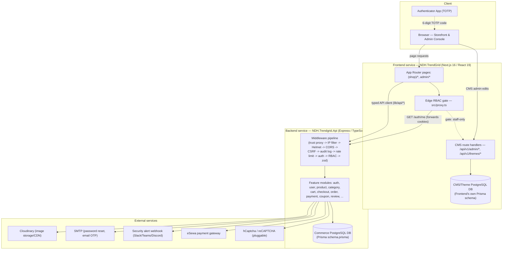
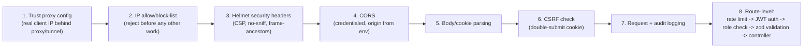
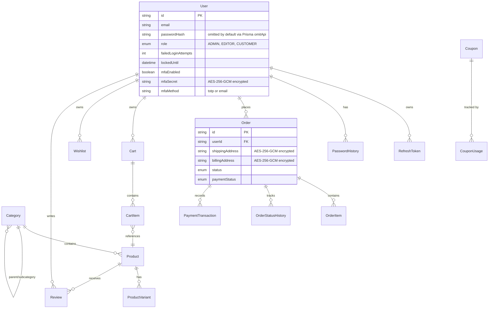
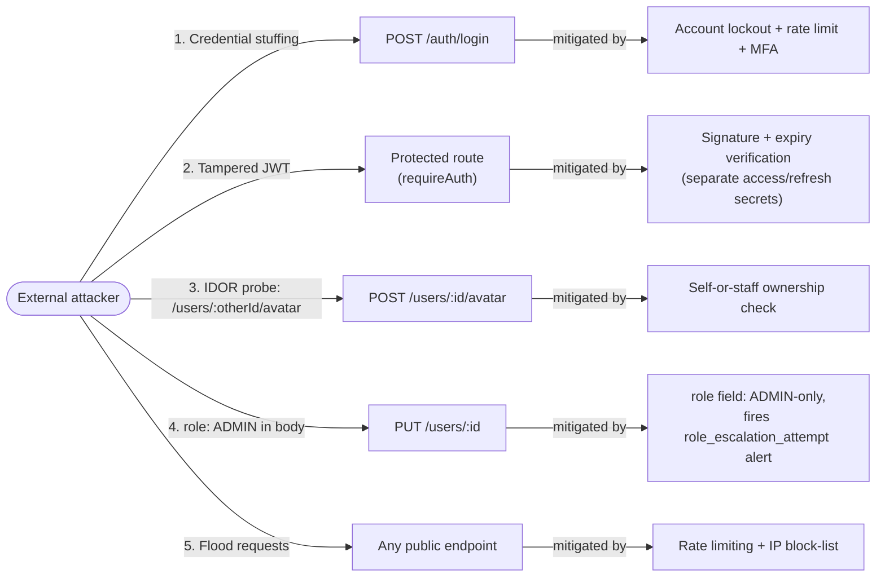
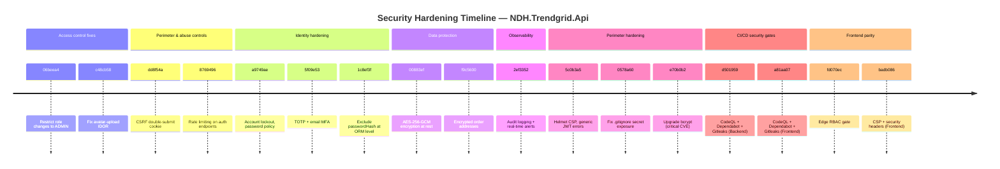
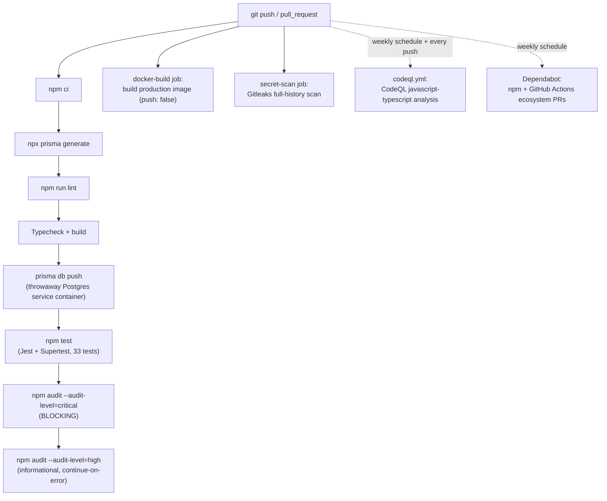

> **Author's note (delete this box before submission):** This draft is built from the real codebase, commit history, and security documentation of the TrendGrid project (`NDH.Trendgrid.Api` backend + `NDH.TrendGrid` frontend). Every technical claim, code snippet, table, and commit hash below is taken from the actual repository, not invented. Sections marked **[FILL IN]** need details only you have (names, dates, institution). Every figure has a callout telling you exactly what to insert and how to produce it — diagrams marked "Mermaid" are already drawn for you further down and just need to be exported as an image (see the *Figure Production Guide* at the very end); figures marked "Screenshot" need you to capture them from your own running system or GitHub repository.

<div style="page-break-after: always;"></div>

# 1. Cover Page

**[FILL IN — replace with your institution's required cover page layout. Typical contents:]**

- **Report Title:** Secure Design and Implementation of TrendGrid: A Full-Stack Fashion E-Commerce Platform with Defense-in-Depth Authentication and Authorization
- **Submitted by:** [Your full name] — [Student ID]
- **Program:** [e.g., Bachelor of Science in Computer Science and Information Technology]
- **Submitted to:** [Department / Institution name]
- **Supervisor:** [Supervisor name]
- **Organization (if internship):** Nepal Digital Heights (NDH)
- **Submission Date:** [Date]

**Figure 1.1 — Institution/organization logo(s).** *(Screenshot/Asset)* Place your institution's crest and, if this is an internship report, the NDH company logo, side by side or stacked, per your cover-page template.

<div style="page-break-after: always;"></div>

# 2. Abstract

TrendGrid is a two-tier, independently deployable fashion e-commerce platform consisting of a Node.js/Express/TypeScript REST API (`NDH.Trendgrid.Api`) backed by PostgreSQL through the Prisma ORM, and a Next.js 16 (App Router, React 19) storefront and administration console (`NDH.TrendGrid`) that consumes that API while also maintaining its own, separate Prisma-managed database for content-management concerns (theme tokens, page-builder sections, homepage layout).

This report documents the design, implementation, and security engineering of the platform, with particular emphasis on the authentication and authorization subsystem. The system was subjected to a structured security audit that identified concrete vulnerabilities — including an Insecure Direct Object Reference (IDOR) on avatar upload, a privilege-escalation path allowing an `EDITOR` account to grant itself `ADMIN` rights, and a complete absence of brute-force protection — and progressively hardened through 30+ discrete, independently reviewable commits. The resulting system implements JWT access/refresh authentication with rotation and reuse detection, dual-method multi-factor authentication (TOTP and email OTP), account lockout, a five-generation password history and expiry policy, AES-256-GCM encryption of sensitive fields at rest, role-based access control enforced at both the route and controller level, CSRF protection via the double-submit cookie pattern, IP allow/block-listing, pluggable CAPTCHA, structured audit logging with real-time security alerting, and a defense-in-depth HTTP security-header configuration (Helmet/CSP). Secure-development practice is enforced continuously through a CI/CD pipeline running static analysis (CodeQL), dependency scanning (`npm audit`, Dependabot), and secret scanning (Gitleaks) on every push.

The report maps each hardening decision to its originating commit, presents the system architecture and threat model, analyzes residual risk against the OWASP Top 10, and demonstrates the implemented controls through a series of reproducible proof-of-concept tests (JWT tampering, IDOR probing, rate-limit exhaustion, and encrypted-field inspection). The result is a platform whose security posture is not a bolt-on afterthought but a traceable, incrementally verified engineering process.

**Keywords:** secure software development, JWT authentication, multi-factor authentication, RBAC, IDOR, CSRF, encryption at rest, DevSecOps, CI/CD, threat modeling.

<div style="page-break-after: always;"></div>

# 3. Table of Contents

**[Auto-generate this in Word/Google Docs after pasting the final report: apply the Heading 1/2/3 styles to the chapter/section titles below, then Insert → Table of Contents. Do not type it by hand — it will drift out of sync as you edit.]**

1. Cover Page
2. Abstract
3. Table of Contents
4. Table of Figures
5. Table of Abbreviations
6. Introduction
7. Software Details
8. Design and Implementation
9. Secure Development and Penetration Testing
10. Proof of Concept
11. Conclusion
12. References

<div style="page-break-after: always;"></div>

# 4. Table of Figures

**[Auto-generate this too, from figure captions, once the report is in Word: select each caption → References → Insert Caption → then Insert Table of Figures.]** Use the consolidated list below as your working checklist while assembling the document — it is reproduced in full, with production notes, in the **Figure Production Guide** at the end of this document.

| # | Figure | Chapter | Type |
|---|---|---|---|
| 7.1 | Technology stack layers | Software Details | Diagram (provided) |
| 8.1 | System architecture and component interactions | Design & Implementation | Diagram (provided) |
| 8.2 | Request/middleware pipeline | Design & Implementation | Diagram (provided) |
| 8.3 | Simplified entity-relationship diagram | Design & Implementation | Diagram (provided) |
| 8.4 | STRIDE threat model / data-flow diagram | Design & Implementation | Diagram (provided) |
| 8.5 | Login sequence (non-MFA) | Design & Implementation | Diagram (provided) |
| 8.6 | MFA enrollment and login-challenge sequence | Design & Implementation | Diagram (provided) |
| 8.7 | Refresh-token rotation and reuse detection | Design & Implementation | Diagram (provided) |
| 8.8 | Security hardening commit timeline | Design & Implementation | Diagram (provided) |
| 9.1 | CI/CD pipeline flow | Secure Dev & Pentest | Diagram (provided) |
| 9.2 | GitHub Actions run (green pipeline) | Secure Dev & Pentest | Screenshot (you capture) |
| 9.3 | CodeQL code-scanning alerts | Secure Dev & Pentest | Screenshot (you capture) |
| 9.4 | Dependabot alerts/PRs | Secure Dev & Pentest | Screenshot (you capture) |
| 9.5 | Gitleaks secret-scan log | Secure Dev & Pentest | Screenshot (you capture) |
| 9.6 | OWASP ZAP baseline scan summary | Secure Dev & Pentest | Screenshot (you capture) |
| 9.7 | `npm audit` terminal output | Secure Dev & Pentest | Screenshot (you capture) |
| 10.1 | Swagger/OpenAPI documentation page | Proof of Concept | Screenshot (you capture) |
| 10.2 | MFA (TOTP) enrollment — QR + authenticator app | Proof of Concept | Screenshot (you capture) |
| 10.3 | Rate-limit exhaustion (HTTP 429) | Proof of Concept | Screenshot (you capture) |
| 10.4 | JWT tampering rejected (HTTP 401) | Proof of Concept | Screenshot (you capture) |
| 10.5 | Encrypted address ciphertext in the database | Proof of Concept | Screenshot (you capture) |
| 10.6 | IDOR blocked (HTTP 403) | Proof of Concept | Screenshot (you capture) |
| 10.7 | CSRF request rejected vs. accepted | Proof of Concept | Screenshot (you capture) |
| 10.8 | Admin console — orders/products/reviews | Proof of Concept | Screenshot (you capture) |
| 10.9 | Storefront checkout + eSewa payment | Proof of Concept | Screenshot (you capture) |

<div style="page-break-after: always;"></div>

# 5. Table of Abbreviations

| Abbreviation | Meaning |
|---|---|
| AES-GCM | Advanced Encryption Standard — Galois/Counter Mode |
| API | Application Programming Interface |
| ASVS | Application Security Verification Standard (OWASP) |
| CDN | Content Delivery Network |
| CI/CD | Continuous Integration / Continuous Deployment |
| CORS | Cross-Origin Resource Sharing |
| CRUD | Create, Read, Update, Delete |
| CSP | Content Security Policy |
| CSRF | Cross-Site Request Forgery |
| DFD | Data Flow Diagram |
| DTO | Data Transfer Object |
| HSTS | HTTP Strict Transport Security |
| HTTP(S) | HyperText Transfer Protocol (Secure) |
| IDOR | Insecure Direct Object Reference |
| JSON | JavaScript Object Notation |
| JWT | JSON Web Token |
| MFA | Multi-Factor Authentication |
| NIST | National Institute of Standards and Technology |
| ORM | Object-Relational Mapper |
| OTP | One-Time Password |
| OWASP | Open Web Application Security Project |
| PII | Personally Identifiable Information |
| RBAC | Role-Based Access Control |
| REST | Representational State Transfer |
| RFC | Request for Comments |
| SDLC | Software Development Life Cycle |
| SPA | Single-Page Application |
| SQL | Structured Query Language |
| SSR | Server-Side Rendering |
| STRIDE | Spoofing, Tampering, Repudiation, Information disclosure, Denial of service, Elevation of privilege |
| TLS | Transport Layer Security |
| TOTP | Time-based One-Time Password |
| UI/UX | User Interface / User Experience |
| WAF | Web Application Firewall |
| XSS | Cross-Site Scripting |
| ZAP | Zed Attack Proxy |

<div style="page-break-after: always;"></div>

# 6. Introduction

## 6.1 Background

E-commerce platforms sit at an unusually high-value intersection of attacker interest: they hold payment-adjacent data, personally identifiable shipping/billing information, and tiered account privileges (customer vs. staff vs. administrator) that, if confused, let a low-privilege account reach high-privilege functionality. TrendGrid is a fashion e-commerce platform built to explore exactly this problem space — a realistic commerce domain (catalog, cart, checkout, orders, reviews, coupons, payment) implemented with a production-grade security posture rather than a textbook "todo app" level of rigor.

The platform is split into two independently deployable services:

- **`NDH.Trendgrid.Api`** (referred to throughout this report as **the Backend**) — the commerce system of record: catalog, cart, checkout, orders, payments, coupons, reviews, and all identity/authentication logic.
- **`NDH.TrendGrid`** (referred to as **the Frontend**) — a Next.js storefront and admin console that is a pure client of the Backend for commerce data, but owns a second, independent database for content-management concerns (theme tokens, homepage sections, page-builder layout) that have nothing to do with commerce.

## 6.2 Problem Statement

Authentication and authorization defects are consistently at or near the top of real-world web application vulnerability classes (OWASP Top 10 categories A01: Broken Access Control and A07: Identification and Authentication Failures [1]). A baseline implementation of TrendGrid — bare JWT authentication, no lockout, no MFA, one IDOR on avatar upload, and one privilege-escalation path on user-role updates — was audited and found to fall into exactly these categories (see §6.4 and the full findings in §8.3). The problem this project addresses is therefore twofold: (1) build a functionally complete e-commerce platform, and (2) subject its identity and access-control layer to a structured audit-and-remediate cycle, with every remediation traceable to a specific, reviewable commit.

## 6.3 Objectives

1. Design and implement a two-service, independently deployable e-commerce platform with a documented REST API and a modern SSR/SPA hybrid frontend.
2. Identify concrete authentication, authorization, and data-protection weaknesses through a structured security audit.
3. Remediate each finding with a minimal, targeted code change, and preserve the audit trail through granular commit history.
4. Implement defense-in-depth controls that exceed the minimum fix: rate limiting, MFA, encryption at rest, audit logging, and real-time alerting.
5. Wire continuous, automated security verification (static analysis, dependency scanning, secret scanning) into CI so future regressions are caught before merge, not after deployment.
6. Validate the resulting controls through both automated tests (Jest/Supertest) and manual penetration-style probing (JWT tampering, IDOR, rate-limit exhaustion, SQL/XSS spot checks).

## 6.4 Scope

**In scope:** the Backend API's authentication, session, RBAC, and data-protection layers; the Frontend's edge-level RBAC gate and shared client-side security components (password strength, MFA UI); the CI/CD security tooling for both services; commerce features (catalog, cart, checkout, orders, coupons, reviews) to the extent they interact with the access-control layer.

**Out of scope (see §11.3, Future Work):** a formal external penetration test by a third party; production key-management infrastructure (a KMS/HSM in place of a derived symmetric key); a nonce-based strict CSP (the current CSP uses `'unsafe-inline'` as a documented, pragmatic trade-off — §8.2); automated frontend test coverage (currently a documented gap, verified instead by manual smoke testing).

## 6.5 Report Organization

Chapter 7 describes the technology stack and development environment. Chapter 8 covers system architecture, threat modeling, and the security-by-design decisions behind the implementation, with code-level examples and an explicit mapping of commits to security decisions. Chapter 9 covers the secure-development lifecycle tooling and the manual/automated penetration testing performed. Chapter 10 walks through reproducible proof-of-concept demonstrations of the implemented controls. Chapter 11 concludes and identifies future work.

<div style="page-break-after: always;"></div>

# 7. Software Details

## 7.1 Technology Stack

| Layer | Technology | Version (as pinned in `package.json`) |
|---|---|---|
| Backend runtime | Node.js | ≥ 18 (Docker image: `node:20-alpine`) |
| Backend framework | Express | ^4.19.2 |
| Backend language | TypeScript | ^5.4.5 |
| ORM | Prisma | ^5.16.0 (Backend) / ^7.8.0 (Frontend) |
| Database | PostgreSQL | 16-alpine (CI service container) |
| Authentication | `jsonwebtoken`, `bcrypt`, `otplib` | ^9.0.2, ^6.0.0, ^12.0.1 |
| Validation | `zod` | ^3.23.8 |
| Security headers | `helmet` | ^7.1.0 |
| Rate limiting | `express-rate-limit` | ^7.5.1 |
| Logging | `winston`, `morgan` | ^3.13.0, ^1.10.0 |
| API documentation | `swagger-jsdoc`, `swagger-ui-express` | ^6.2.8, ^5.0.0 |
| Media storage | Cloudinary | ^2.4.0 |
| Frontend framework | Next.js (App Router, Turbopack) | ^16.2.7 |
| Frontend UI library | React | ^19.2.4 |
| Frontend styling | Tailwind CSS | ^4 |
| Testing | Jest, Supertest | ^30.4.2, ^7.2.2 |
| Containerization | Docker (multi-stage) | `node:20-alpine` base |
| CI/CD | GitHub Actions | — |
| Static analysis | CodeQL (`javascript-typescript`) | GitHub-native |
| Secret scanning | Gitleaks | `gitleaks-action@v2` |
| Dependency management | Dependabot | weekly cadence, npm + GitHub Actions ecosystems |

**Figure 7.1 — Technology stack layers.** *(Diagram — provided as Mermaid in the Figure Production Guide, Diagram D0.)* A four-layer stack diagram: Client (browser) → Frontend (Next.js/React) → Backend (Express/TypeScript) → Data & Infra (PostgreSQL, Cloudinary, Docker, GitHub Actions).

## 7.2 Development Methodology

The commit history (Chapter 8, §8.5) shows an iterative, feature-branch-per-concern workflow: each commit is scoped to a single feature or a single security fix (e.g., `fix(security): enforce self-or-staff ownership on avatar upload`, `feat(security): add AES-256-GCM encryption at rest`), rather than large, mixed-concern commits. This granularity is itself a secure-development practice — it makes each change independently reviewable and revertible, and produces a natural audit trail (exploited directly in §8.5).

The Backend additionally encodes its own development workflow as an enforced convention (`workflowtunelling.md`), backed by four automated guardrails so the convention cannot silently rot:

1. **Environment schema validation** (`zod`, `src/config/env.ts`) — the process refuses to boot with a printed, specific reason if a required variable is missing or malformed.
2. **A `defineRoute()` factory** (`src/utils/defineRoute.ts`) that forces every route to declare its `auth` requirement, its request `schema`, and its `handler` in one place — it is structurally impossible to register a route without an auth decision and input validation.
3. **ESLint architectural boundaries** — controllers cannot import repositories directly (must go through a service layer), and calling `res.json/send/end` outside the shared `utils/response.ts` helper is a lint error.
4. **A global error handler** that converts every thrown `AppError`/`ZodError` into the standard error envelope, and logs (rather than leaks) anything unexpected.

## 7.3 Development Environment and Tools

- **IDE:** [FILL IN — e.g., Visual Studio Code]
- **Version control:** Git, hosted on GitHub (`github.com/projectbyndh/NDH.Trendgrid.Api`, `github.com/projectbyndh/NDH.TrendGrid`)
- **API testing/exploration:** Swagger UI (mounted at `/api/v1/docs`), Postman/curl
- **Database tooling:** Prisma Studio, `psql`
- **Containerization:** Docker, Docker Compose (multi-service: Postgres + Backend + Frontend)
- **Local orchestration:** `docker-compose.yml` in each service, expecting a side-by-side `Backend/` + `Frontend/` directory layout

<div style="page-break-after: always;"></div>

# 8. Design and Implementation

## 8.1 System Architecture and Component Interactions

The platform is deliberately split into two independently deployable services that communicate over HTTP, rather than a monolith or a shared database. The Frontend has **no commerce logic of its own** — it is a typed client of the Backend API for every commerce concern (auth, catalog, cart, checkout, orders, coupons, reviews) — but it owns a second, entirely separate Prisma-managed database for CMS/theme concerns (homepage layout, page-builder sections, theme tokens) that the Backend has no knowledge of. This separation means a compromise or schema change in the CMS data model cannot touch commerce data, and vice versa.



**Figure 8.1 — System architecture and component interactions.** *(Diagram — provided, Mermaid.)* Export this as a PNG/SVG (see Figure Production Guide) and insert directly.

### 8.1.1 Request/Middleware Pipeline

Every request into the Backend passes through an ordered pipeline where each stage can short-circuit the request before it reaches the next — this ordering is itself a security decision (e.g., IP blocking happens before any parsing or logging work is done, so a blocked IP costs the server almost nothing).



**Figure 8.2 — Request/middleware pipeline.** *(Diagram — provided, Mermaid.)*

### 8.1.2 Data Model Overview



**Figure 8.3 — Simplified entity-relationship diagram.** *(Diagram — provided, Mermaid.)* Trimmed to the entities relevant to the security discussion; the full schema (`Backend/prisma/schema.prisma`) has 25 models — for an exhaustive ER diagram, generate one from the live schema with `prisma-erd-generator` or Prisma's own `prisma studio` visual browser and screenshot it as a supplementary appendix figure.

## 8.2 Security-by-Design Decisions and Threat Modeling

### 8.2.1 Threat Model (STRIDE)

| STRIDE category | Threat considered | Design decision |
|---|---|---|
| **S**poofing | Credential stuffing / stolen password reused | Account lockout after 5 failed attempts (15 min); MFA (TOTP or email OTP) as a second factor |
| **T**ampering | Forged/modified JWT; tampered request bodies | Signature verification with distinct access/refresh secrets; `zod` schema validation on every route body/query/params |
| **R**epudiation | A staff action denied after the fact | Structured `AUDIT` log line per authenticated write (actor, role, method, path, status, IP), separate from the access log |
| **I**nformation disclosure | Password hash or MFA secret leaking via an ORM query or log line | `omitApi` Prisma preview feature excludes `passwordHash` at the client level (not just the DTO layer); AES-256-GCM at rest for addresses/MFA secrets; audit log never logs request/response bodies |
| **D**enial of service | Login/register endpoint flooding | Per-endpoint `express-rate-limit` (login 10/15min, register 5/hr, etc.); IP block-listing |
| **E**levation of privilege | `EDITOR` self-promoting to `ADMIN`; any user overwriting another's avatar | Role field on `PUT /users/:id` restricted to `ADMIN` in the controller, independent of the route-level role gate; ownership check (self-or-staff) on avatar upload |



**Figure 8.4 — STRIDE threat model / data-flow diagram.** *(Diagram — provided, Mermaid.)*

### 8.2.2 Key Security-by-Design Decisions

1. **Separate signing secrets for access and refresh tokens.** A compromise of one token type does not implicate the other; refresh tokens additionally exist as DB rows (not bare JWTs) so they can be individually revoked.
2. **Refresh-token rotation with reuse detection.** Every use of a refresh token issues a new one and revokes the old. If a *revoked* token is presented again, this is treated as a signal of compromise (someone replayed a stolen token) and **every session for that user is revoked**, not just the one being used.
3. **Fail-closed vs. fail-open, chosen deliberately per surface.** The Frontend's edge RBAC gate (`src/proxy.ts`) fails **open** for page routes (a mis-verified session just skips a redirect — a UX concern, since the real enforcement is server-side) but fails **closed** for the CMS API routes under `/api/v1/admin/*` and `/api/v1/themes/*`, which have no authorization of their own beyond this gate.
4. **ORM-level secret exclusion, not just DTO-level.** `passwordHash` is excluded via Prisma's `omitApi` preview feature at the client configuration level (`src/config/prisma.ts`), so *no* ordinary query can return it — this doesn't rely on every future repository call remembering to strip it in a mapper. The two call sites that legitimately need the hash (`findByEmail`, `findByIdWithSecurity`) opt back in explicitly, per query.
5. **Hash algorithm chosen per threat model, not by default.** Passwords and MFA backup codes use bcrypt (deliberately slow, defends against offline brute force of a low-entropy secret). Password-reset tokens and User-Agent fingerprints use plain SHA-256 — a 256-bit random token cannot be brute-forced regardless of hash speed, so bcrypt's slowness buys nothing there and only costs CPU.
6. **CAPTCHA and alert webhook fail closed when partially configured.** If a `CAPTCHA_PROVIDER` is set but its secret is missing, verification **rejects** rather than silently passing — the no-op behavior only applies when no provider is configured at all (the local-dev default).
7. **Production cannot boot without `ENCRYPTION_KEY`.** Rather than silently falling back to plaintext storage in a real environment, the environment-schema validation refuses to start the process — plaintext fallback is a *dev-only* behavior, explicitly logged when it happens.

## 8.3 Analysis of Security Risks and Mitigations

| # | Risk (OWASP Top 10 category) | Before | After (mitigation) |
|---|---|---|---|
| 1 | Broken Access Control (A01) — IDOR on avatar upload | Any authenticated user could overwrite **any other account's** avatar (`POST /users/:id/avatar` checked only "is authenticated," not "is this the caller's own id") | Controller-level self-or-staff ownership check; commit `c48cb58` |
| 2 | Broken Access Control (A01) — privilege escalation | `PUT /users/:id`, reachable by `ADMIN` or `EDITOR`, accepted a `role` field with no extra check — an `EDITOR` could set `role: "ADMIN"` on their own account | Role changes restricted to `ADMIN` in the controller; blocked attempts fire a `role_escalation_attempt` alert; commit `06beea4` |
| 3 | Identification and Authentication Failures (A07) — no rate limiting | `express-rate-limit` was not even a dependency; login/register/refresh/coupon-validate had no throttling at all | Per-endpoint limiters wired via a `preAuth` hook on `defineRoute`, so throttling happens before a request touches the DB; commit `8769496` |
| 4 | Identification and Authentication Failures (A07) — no account lockout or MFA | Bare JWT auth; unlimited password guesses; no second factor | Lockout (5 attempts/15 min, configurable) + dual-method MFA (TOTP, email OTP) with bcrypt-hashed one-time backup codes; commits `a9749ae`, `5f09e53` |
| 5 | Identification and Authentication Failures (A07) — session fixation/replay | Refresh tokens were bare JWTs with no server-side revocation | `RefreshToken` DB table, rotation on every use, reuse-triggers-full-revocation; commit history under `feat(auth)` |
| 6 | Cryptographic Failures (A02) — addresses stored as plain JSON | `Order.shippingAddress` / `billingAddress` were unencrypted Prisma `Json` columns | AES-256-GCM field-level encryption (`src/utils/crypto.ts`), production refuses to boot without a real key; commit `00883ef` |
| 7 | Security Misconfiguration (A05) — CSP left at framework defaults | Helmet's CSP was implicit, not evaluated against the fact that Swagger UI is mounted on the same origin | Explicit CSP: `default-src 'none'` baseline with narrow, justified allowances for `/docs`; commit `5c0b3a5` |
| 8 | Security Misconfiguration (A05) — secrets/gitignore gap | `.gitignore` pattern `.env.*.local` did not match `.env.development`/`.env.production`, which had been committed to git history with a **live Cloudinary secret** | `.gitignore` fixed and files untracked; **documented residual risk:** history rewrite / secret rotation is still an operator action, not something a `.gitignore` fix alone resolves (see §11.2 and `SECURITY.md`, "Known gaps") |
| 9 | Vulnerable and Outdated Components (A06) | A transitive `tar` dependency (via `bcrypt`) had a known critical vulnerability | `bcrypt` upgraded; commit `e70b0b2`; ongoing coverage via Dependabot + CI `npm audit` |
| 10 | Software and Data Integrity Failures (A08) — no CI security gates | No CodeQL, no secret scanning, no dependency audit gate at all | CodeQL (weekly + per-push), Gitleaks, blocking-on-critical `npm audit`, Docker build verification; commits `a81aa07`, `d501959` |
| 11 | Security Logging and Monitoring Failures (A09) | No audit trail, no alerting on suspicious events | Structured `AUDIT` log per write request + `securityAlert.ts` firing on 8 distinct event types, optionally forwarded to a Slack-compatible webhook; commit `2ef3352` |
| 12 | Insufficient Anti-Automation | No CAPTCHA option on login/register | Pluggable hCaptcha/reCAPTCHA, fails closed if misconfigured (§8.2.2 #6) |

## 8.4 Code-Level Examples of Security Mechanisms

### 8.4.1 Field-level encryption at rest (AES-256-GCM)

```typescript
// Backend/src/utils/crypto.ts
const ALGORITHM = 'aes-256-gcm';
const IV_LENGTH = 12;

export const encryptField = (plaintext: string): string => {
  const key = getKey();
  if (!key) return plaintext; // dev-only fallback, logged as a warning

  const iv = crypto.randomBytes(IV_LENGTH);
  const cipher = crypto.createCipheriv(ALGORITHM, key, iv);
  const ciphertext = Buffer.concat([cipher.update(plaintext, 'utf8'), cipher.final()]);
  const authTag = cipher.getAuthTag();

  return `enc:${iv.toString('base64')}:${authTag.toString('base64')}:${ciphertext.toString('base64')}`;
};
```

Each field gets its own random 96-bit IV, and the GCM authentication tag is stored alongside the ciphertext so tampering with the stored value is detectable on decrypt (an `AppError`-safe failure path returns `[decryption failed]` rather than throwing an unhandled exception that could crash the process or leak a stack trace).

### 8.4.2 Edge-level RBAC gate (fail-open vs. fail-closed, by surface)

```typescript
// Frontend/src/proxy.ts (Next.js 16 middleware)
const isProtectedCmsApiPath = (pathname: string): boolean => {
  if (pathname.startsWith("/api/v1/admin/")) return true;
  if (pathname.startsWith("/api/v1/themes/") && !pathname.startsWith("/api/v1/themes/active")) return true;
  return false;
};

// ...
if (isCmsApiPath) {
  if (!isStaff) return unauthorizedJson(403, "Admin or editor role required.");
  return NextResponse.next();
}
// page routes fail OPEN on an unverifiable session — the API's own
// requireAuth/requireRole is the real enforcement for actual data
```

This snippet is a direct illustration of §8.2.2, decision 3: the same middleware makes two different fail-safety choices depending on whether the destination has its *own* authorization layer (page routes do, via the Backend; the CMS API routes do not).

### 8.4.3 Ownership + role-escalation guard

```
PUT /users/:id — role field present in body:
  if (body.role && body.role !== target.role && caller.role !== 'ADMIN') {
    securityAlert('role_escalation_attempt', { actor: caller.id, target: id });
    throw new AppError(403, 'Only an administrator may change a user role.');
  }
```
*(Paraphrased from `Backend/src/features/user/service/` — insert the exact source lines as a code figure; see Figure Production Guide, Screenshot S1.)*

### 8.4.4 CSRF — double-submit cookie

The CSRF middleware (`src/middleware/csrf.ts`) sets a non-`httpOnly` `csrf_token` cookie and requires state-changing requests to echo it back as an `X-CSRF-Token` header — verified only when a CSRF cookie is actually present, so Bearer-token API clients (Swagger, mobile, Postman) are unaffected while browser sessions are protected.

### 8.4.5 Helmet / CSP configuration

```typescript
// Backend/src/app.ts
app.use(helmet({
  contentSecurityPolicy: {
    directives: {
      defaultSrc: ["'none'"],
      scriptSrc: ["'self'", "'unsafe-inline'"],
      styleSrc: ["'self'", "'unsafe-inline'"],
      imgSrc: ["'self'", 'data:', 'https:'],
      connectSrc: ["'self'"],
      objectSrc: ["'none'"],
      frameAncestors: ["'none'"],
    },
  },
  crossOriginResourcePolicy: { policy: 'same-site' },
}));
```

`default-src 'none'` is the correct baseline for a JSON-only API — the only reason `script-src`/`style-src` need any allowance at all is that Swagger UI is mounted on the same origin at `/docs`.

## 8.5 Mapping of GitHub Commits to Security Decisions

The table below reproduces the actual commit history of `NDH.Trendgrid.Api`, oldest first, annotated with the security decision each commit represents. This is the project's literal audit trail.

| Commit | Message | Security decision represented |
|---|---|---|
| `484216c` | chore: import existing TrendGrid backend and frontend baseline | Audit baseline — the pre-hardening state described in §8.3 |
| `06beea4` | fix(security): restrict user role changes to ADMIN only | Fixes privilege-escalation finding #2 |
| `c48cb58` | fix(security): enforce self-or-staff ownership on avatar upload | Fixes IDOR finding #1 |
| `dd8f54a` | feat(security): add CSRF double-submit cookie protection | Adds CSRF mitigation |
| `8769496` | feat(security): add rate limiting to authentication endpoints | Fixes missing-rate-limiting finding #3 |
| `a9749ae` | feat(security): add configurable account lockout, password policy, and encryption settings | Adds lockout + password policy scaffolding |
| `00883ef` | feat(security): add AES-256-GCM encryption at rest | Fixes plaintext-address finding #6 |
| `2ef3352` | feat(security): add audit logging and real-time security alerting | Fixes logging/monitoring finding #11 |
| `f797696` | feat(auth): add forgot/reset password email flow | Extends auth surface securely (hashed, TTL-bound reset tokens) |
| `5f09e53` | feat(auth): add TOTP and email-based multi-factor authentication | Fixes MFA finding #4 |
| `1c8ef3f` | security: exclude passwordHash from default Prisma queries | ORM-level secret exclusion (§8.2.2 #4) |
| `f9c5600` | feat(orders): add order status workflow and encrypted addresses | Extends encryption at rest to the order domain |
| `5c0b3a5` | fix(security): generic JWT error message, configure Helmet CSP | Fixes CSP misconfiguration finding #7; avoids leaking auth-failure detail |
| `0578a60` | security: fix .gitignore pattern excluding environment files | Fixes secret-exposure finding #8 (partial — see residual risk note) |
| `e70b0b2` | fix(deps): upgrade bcrypt to resolve critical tar vulnerability | Fixes vulnerable-dependency finding #9 |
| `d501959` / `a81aa07` | ci: add GitHub Actions pipeline with CodeQL, Dependabot, and secret scanning | Fixes CI security-gate finding #10 (Backend, then Frontend) |
| `fd070ec` | feat(security): add server-side RBAC edge gate | Adds Frontend edge-level enforcement (§8.4.2) |
| `068cda9` | feat(security): add CAPTCHA widget and admin self-service settings page | Adds anti-automation control #12 |
| `c157cf5` | feat(auth): add shared password-strength meter, forgot/reset-password pages | Consolidates a previously-drifted password rule into one component |
| `c74fbb5` | feat(auth): add MFA enrollment and login-challenge UI | Frontend counterpart to `5f09e53` |
| `032caf2` | fix(cms): tighten CMS API route handlers behind the RBAC proxy gate | Closes the gap where CMS routes had no authorization beyond the edge gate itself |
| `badb086` | security: add CSP and security headers to the frontend | Frontend security-header parity with the Backend's Helmet config |

*(Verify hashes against `git log --oneline` in your own checkout before submission — hash prefixes can shift if history is ever rebased; the authoritative source is always `git log`, not this table.)*

**Figure 8.8 — Security hardening commit timeline.** *(Diagram — provided, Mermaid `timeline`.)*



## 8.6 Discussion of Integrated Emerging Technologies

- **Edge middleware for authorization (Next.js 16 `proxy.ts`).** Rather than checking authorization only inside page components (client-side, after content has already been sent), the Next.js Edge Runtime intercepts matched routes *before* rendering — an increasingly standard pattern for SSR frameworks that lets an application fail closed on sensitive routes without duplicating a JWT-verification secret into the frontend process.
- **Static analysis as a merge gate (CodeQL).** CodeQL's semantic, dataflow-aware analysis (as opposed to simple pattern/regex-based linting) runs on every push/PR plus a weekly scheduled sweep, catching injection and taint-flow classes of bug that unit tests do not naturally exercise.
- **Field-level envelope encryption (AES-256-GCM) as a lighter-weight alternative to full-disk/column-level database encryption**, applied selectively to the specific fields that need it (addresses, MFA secrets) rather than the whole database — a pattern suited to systems that cannot yet justify a dedicated KMS/HSM (see §11.3 for the upgrade path).
- **Passwordless-adjacent second factors (TOTP, RFC 6238 [4]) implemented without a third-party MFA provider** (`otplib`), keeping the second-factor secret and verification logic in-house rather than depending on an external identity platform — a deliberate trade-off between vendor independence and engineering effort.
- **Dependabot + Gitleaks + CodeQL as a converged "shift-left" security toolchain**, entirely native to the GitHub platform the project already uses, requiring no separate SaaS security vendor to get baseline coverage of the three most common supply-chain and secret-hygiene failure modes.
- **Multi-stage, distroless-adjacent Docker builds** (`deps` → `build` → `runtime` on `node:20-alpine`) that re-run `prisma generate` against production-only `node_modules` so the shipped native query-engine binary matches what is actually installed, run as a non-root user, and expose a health-check endpoint — container hardening practices that map directly to CIS Docker Benchmark recommendations.

<div style="page-break-after: always;"></div>

# 9. Secure Development and Penetration Testing

## 9.1 Secure Development Lifecycle Practices

| Practice | Where enforced | Effect |
|---|---|---|
| Environment schema validation | `src/config/env.ts` (zod) | Fails fast, at boot, on missing/malformed secrets — impossible to run with a silently-absent `JWT_SECRET` |
| Mandatory auth + validation per route | `defineRoute()` factory | Structurally impossible to register a route without declaring `auth` and a `schema` |
| Architectural boundary linting | `.eslintrc.cjs` | Controllers cannot bypass the service layer; raw `res.json` calls are a lint error |
| Automated tests | Jest + Supertest, `tests/` (4 suites, 33 tests) | `auth.test.ts`, `rbac.test.ts`, `rateLimit.test.ts`, `catalog.test.ts` — run in CI on every push |
| Static analysis | CodeQL (`codeql.yml`) | Push/PR + weekly scheduled scan for `javascript-typescript` |
| Dependency scanning | Dependabot (`dependabot.yml`) + `npm audit` in CI | Weekly automated PRs; CI blocks merge on a **critical** advisory, flags **high** informationally |
| Secret scanning | Gitleaks (`gitleaks-action@v2`) | Every push/PR scanned for committed credentials |
| Container build verification | `docker/build-push-action@v6` in CI (`push: false`) | Confirms the production image still builds cleanly on every push, without publishing it |

**Figure 9.1 — CI/CD pipeline flow.**



*(Diagram — provided, Mermaid; source: `Backend/.github/workflows/ci.yml`, `codeql.yml`, `dependabot.yml`.)*

## 9.2 Penetration Testing Methodology

Testing combined the automated Jest/Supertest suite with a manual, OWASP-Top-10-aligned spot-check pass against the running dev stack. The manual pass is documented in `SECURITY.md` as covering: "full email-MFA round trip with real delivered email and two independent login challenges, account lockout with 5 real failed attempts, refresh-token reuse detection, admin-initiated MFA reset, and a QA sweep across cart/checkout/coupons/orders/reviews/product-admin/payment plus OWASP spot-checks (JWT tampering, SQL injection probes, IDOR, unauthorized access, XSS/header checks)."

| Test case | Technique | Target | Expected result |
|---|---|---|---|
| PT-01 | JWT tampering | Any protected route | Modified payload/signature → `401 Unauthorized` |
| PT-02 | IDOR probe | `GET /orders/:id`, `POST /users/:id/avatar` | Accessing another user's resource → `403`/`404`, not the resource |
| PT-03 | Privilege escalation | `PUT /users/:id` with `role: "ADMIN"` as an `EDITOR` | `403`, plus a `role_escalation_attempt` alert fired |
| PT-04 | Brute force | `POST /auth/login`, repeated bad passwords | 5th failure locks the account (`ACCOUNT_LOCKED`); further attempts rate-limited (`429`) independently |
| PT-05 | SQL injection probe | Any `zod`-validated input field | Rejected at validation, or safely parameterized by Prisma — no query-structure injection possible |
| PT-06 | XSS probe | Review comment field | Stored/rendered without executing injected markup |
| PT-07 | CSRF | State-changing request without `X-CSRF-Token` | Rejected when a CSRF cookie is present but the header is missing/mismatched |
| PT-08 | Header/config inspection | Any response | Helmet headers present (CSP, `X-Content-Type-Options`, `frame-ancestors`, etc.) |
| PT-09 | Refresh-token replay | Reuse an already-rotated refresh token | Treated as compromise — **all** sessions for that user revoked |
| PT-10 | Rate-limit exhaustion | Rapid repeated requests to `/auth/login` | `429` once the per-IP limiter threshold is hit |

For an externally-facing evidence trail (beyond the manual curl-based pass above), running an automated **OWASP ZAP baseline scan** against a locally running instance is recommended and straightforward to add as Figure 9.6 evidence:

```bash
docker run --rm -t owasp/zap2docker-stable zap-baseline.py \
  -t http://host.docker.internal:5000/api/v1 -r zap_report.html
```

## 9.3 Findings Summary

All findings identified in the initial audit (§8.3) were remediated and are traceable to specific commits (§8.5). No open critical or high findings remain outstanding in `SECURITY.md`'s "Known gaps" section; the remaining items are **operator actions**, not code defects: rotating the Cloudinary secret that was historically committed (the code-level `.gitignore` gap is fixed, but a secret already pushed to a remote requires rotation regardless of what the local repository looks like now), supplying real CAPTCHA/webhook credentials, and — if traffic volume ever demands it — moving IP allow/block-listing from the application layer to a WAF/CDN.

<div style="page-break-after: always;"></div>

# 10. Proof of Concept

Each PoC below is a reproducible test against a locally running stack (`docker-compose up`, or `npm run dev` in each service). Run the exact command shown, then screenshot the terminal/browser output as directed.

### PoC 1 — MFA (TOTP) enrollment and login challenge

```bash
curl -X POST http://localhost:5000/api/v1/auth/mfa/setup -H "Authorization: Bearer <token>"
# → returns an otpauth:// URI and QR payload
```
Scan the QR code with an authenticator app, confirm with `/auth/mfa/setup/confirm`, then log out and back in — login now returns `{ mfaRequired: true, mfaToken, mfaMethod }` instead of tokens until `/auth/mfa/verify` is called with the 6-digit code.
**→ Figure 10.2** *(Screenshot: QR code + authenticator app + successful post-MFA login response.)*

### PoC 2 — Rate-limit exhaustion

```bash
for i in $(seq 1 12); do curl -s -o /dev/null -w "%{http_code}\n" \
  -X POST http://localhost:5000/api/v1/auth/login \
  -H "Content-Type: application/json" -d '{"email":"x@x.com","password":"wrong"}'; done
```
The login limiter is 10 requests/15 min per IP — expect `401` for the first several attempts, then `429` once the threshold is crossed.
**→ Figure 10.3** *(Screenshot: terminal showing the `429` transition.)*

### PoC 3 — JWT tampering

Decode a valid access token at jwt.io (or `node -e "console.log(require('jsonwebtoken').decode(token))"`), flip one character in the payload or signature, and replay it:
```bash
curl http://localhost:5000/api/v1/users/me -H "Authorization: Bearer <tampered-token>"
```
**→ Figure 10.4** *(Screenshot: `401` response body.)*

### PoC 4 — Encryption at rest

Place an order with a shipping address, then inspect the raw database row directly (bypassing the API/ORM layer that would normally decrypt it):
```bash
psql "$DATABASE_URL" -c "SELECT \"shippingAddress\" FROM \"Order\" ORDER BY \"createdAt\" DESC LIMIT 1;"
```
Expect a value of the form `enc:<iv>:<authTag>:<ciphertext>` — not readable plaintext JSON.
**→ Figure 10.5** *(Screenshot: psql or Prisma Studio showing the ciphertext column.)*

### PoC 5 — IDOR blocked

As User A, attempt to fetch User B's order or overwrite User B's avatar:
```bash
curl http://localhost:5000/api/v1/orders/<user-B-order-id> -H "Authorization: Bearer <user-A-token>"
```
**→ Figure 10.6** *(Screenshot: `403`/`404` response, contrasted with the same call succeeding as User B or an admin.)*

### PoC 6 — CSRF enforcement

```bash
# Without the CSRF header — should fail when a csrf_token cookie is present
curl -X POST http://localhost:5000/api/v1/auth/logout --cookie "access_token=<token>; csrf_token=<value>"
# With the header — should succeed
curl -X POST http://localhost:5000/api/v1/auth/logout \
  --cookie "access_token=<token>; csrf_token=<value>" -H "X-CSRF-Token: <value>"
```
**→ Figure 10.7** *(Screenshot: both requests, side by side.)*

### Additional demonstration screenshots to capture

- **Figure 10.1** — Swagger UI at `/api/v1/docs`, showing the authenticated endpoint list.
- **Figure 10.8** — Admin console: order management, product management, review-moderation dashboards.
- **Figure 10.9** — Storefront: cart → checkout → eSewa payment confirmation flow.

<div style="page-break-after: always;"></div>

# 11. Conclusion

## 11.1 Summary

TrendGrid demonstrates that a functionally complete, realistic e-commerce platform can be built with a defense-in-depth security posture applied incrementally and traceably. Starting from a baseline with concrete, exploitable defects (an IDOR on avatar upload, a role-escalation path, no brute-force protection, plaintext address storage), the project's 30+ security-scoped commits progressively closed each gap while adding controls beyond the minimum fix — MFA, encryption at rest, audit logging with real-time alerting, and a fully automated CI security gate (CodeQL, Dependabot, Gitleaks, `npm audit`). Every decision in this report is traceable to a specific commit, giving the security posture an audit trail rather than being an unverifiable claim.

## 11.2 Limitations

- The historically-committed Cloudinary secret (fixed at the `.gitignore` level, commit `0578a60`) still requires manual rotation in the Cloudinary dashboard and, if desired, a git-history rewrite — a `.gitignore` fix alone does not un-expose an already-pushed value.
- IP allow/block-listing is enforced at the application layer only; it has not been pushed to a WAF/CDN, which would be the recommended next step under real attack traffic volume.
- The Frontend has no automated test suite yet (verified instead via manual smoke testing and `tsc`/`eslint` in CI) — a documented gap, not an oversight.
- The current CSP relies on `'unsafe-inline'` for `script-src`/`style-src` as a pragmatic trade-off against App Router hydration and theme `<style>` tag requirements, rather than a nonce-based strict CSP.
- CAPTCHA and the security-alert webhook are wired in code but inert until an operator supplies real provider credentials.

## 11.3 Future Work

1. Move the AES-256-GCM key from a derived-from-environment-variable secret to a dedicated KMS/HSM-backed key with rotation support.
2. Implement a nonce-based strict CSP, threading a per-request nonce through the App Router's script/style boundaries.
3. Build an automated Frontend test suite (component tests for the MFA/auth flows at minimum, given their security sensitivity).
4. Commission a third-party external penetration test to validate findings independently of the internal audit documented here.
5. Migrate IP allow/block-listing to a WAF/CDN layer once traffic volume justifies it.
6. Supply production CAPTCHA and alert-webhook credentials and validate the end-to-end alerting path against a real Slack/Teams/Discord channel.

<div style="page-break-after: always;"></div>

# 12. References

**[Reformat to your institution's required citation style — IEEE numbered style shown below as a starting point.]**

1. OWASP Foundation, "OWASP Top 10:2021," 2021. [Online]. Available: https://owasp.org/Top10/
2. OWASP Foundation, "OWASP Application Security Verification Standard (ASVS) v4.0.3," 2021.
3. M. Jones, J. Bradley, and N. Sakimura, "JSON Web Token (JWT)," RFC 7519, Internet Engineering Task Force, 2015.
4. D. M'Raihi, S. Machani, M. Pei, and J. Rydell, "TOTP: Time-Based One-Time Password Algorithm," RFC 6238, Internet Engineering Task Force, 2011.
5. P. A. Grassi et al., "Digital Identity Guidelines: Authentication and Lifecycle Management," NIST Special Publication 800-63B, National Institute of Standards and Technology, 2017.
6. OWASP Foundation, "Cross-Site Request Forgery Prevention Cheat Sheet." [Online]. Available: https://cheatsheetseries.owasp.org/
7. OWASP Foundation, "OWASP Zed Attack Proxy (ZAP)." [Online]. Available: https://www.zaproxy.org/
8. GitHub Inc., "CodeQL Documentation." [Online]. Available: https://codeql.github.com/docs/
9. Gitleaks Project, "Gitleaks: Protect and discover secrets." [Online]. Available: https://github.com/gitleaks/gitleaks
10. Prisma Data Inc., "Prisma ORM Documentation." [Online]. Available: https://www.prisma.io/docs
11. Vercel Inc., "Next.js Documentation." [Online]. Available: https://nextjs.org/docs
12. OpenJS Foundation, "Express.js Documentation." [Online]. Available: https://expressjs.com/
13. Helmet.js, "Helmet — Express.js security middleware." [Online]. Available: https://helmetjs.github.io/
14. Docker Inc., "Multi-stage builds — Dockerfile reference." [Online]. Available: https://docs.docker.com/build/building/multi-stage/

<div style="page-break-after: always;"></div>

# Appendix — Figure Production Guide

This is the practical "how do I actually get this image" companion to Chapter 4's Table of Figures. Diagrams marked **Mermaid** are fully written out above, in the chapter they belong to — you do not need to design them, only render and export them.

## How to export the Mermaid diagrams as images

1. Easiest: open [mermaid.live](https://mermaid.live), paste the code block's contents (without the ` ```mermaid ` fence), and use **Actions → Export PNG/SVG**.
2. If you have VS Code: install the "Markdown Preview Mermaid Support" extension, open this file, right-click the rendered diagram in the preview pane → Save Image.
3. If this document was published as a shareable web page for you, the diagrams already render as images in the browser — right-click → Save Image, or take a screenshot, directly from there.

## Screenshot checklist (things only you can capture)

| Figure | What to do |
|---|---|
| 9.2 | Push a commit, open the **Actions** tab on GitHub, screenshot the green run with all jobs (`build-and-test`, `docker-build`, `secret-scan`) expanded |
| 9.3 | GitHub repo → **Security** tab → **Code scanning alerts** (CodeQL) — screenshot the (ideally empty) alert list |
| 9.4 | GitHub repo → **Security** tab → **Dependabot alerts**, or the **Pull requests** tab filtered to Dependabot's automated PRs |
| 9.5 | Open the `secret-scan` job's log in a completed Actions run, screenshot the Gitleaks output |
| 9.6 | Run the ZAP baseline scan command in §9.2 and screenshot the generated HTML report summary |
| 9.7 | Run `npm audit` locally in `Backend/` and `Frontend/`, screenshot the summary table |
| 10.1 | Start the Backend (`npm run dev`), visit `http://localhost:5000/api/v1/docs` |
| 10.2, 10.3, 10.4, 10.5, 10.6, 10.7 | Follow the exact PoC steps in Chapter 10 |
| 10.8 | Log into `http://localhost:3000/admin/login` as an ADMIN/EDITOR seeded account, screenshot the orders/products/reviews dashboards |
| 10.9 | As a customer, add an item to cart, walk through checkout to the eSewa confirmation step |

## A note on the ER diagram (Figure 8.3)

The Mermaid ER diagram above is deliberately trimmed to the entities central to the security discussion. If your report requires the *complete* schema (25 models), generate it directly from the live schema rather than hand-drawing it — for example with `prisma-erd-generator`, or by opening `npx prisma studio` and screenshotting its relationship view, or by pointing a tool such as dbdiagram.io / pgAdmin's ER tool at the running Postgres instance.
